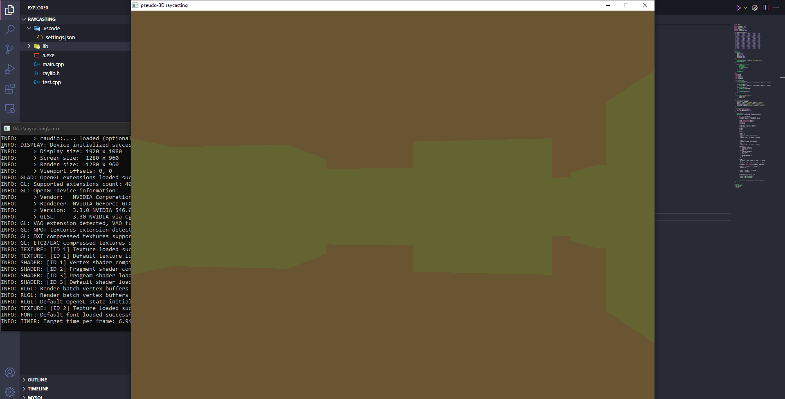

# Raycaster
Quick <a href="https://en.wikipedia.org/wiki/Ray_casting">raycasting</a> project in C++ rendering with <a href="https://www.raylib.com/">raylib</a>

## Build Instructions

To build this project on windows, first download and build raylib, then get raylib.h on the project and libraylib.a on the lib folder. Then, build it with the command

```bash
 g++ main.cpp -lraylib -lopengl32 -lgdi32 -lwinmm
```

and it will generate a file named a.exe to run the project

